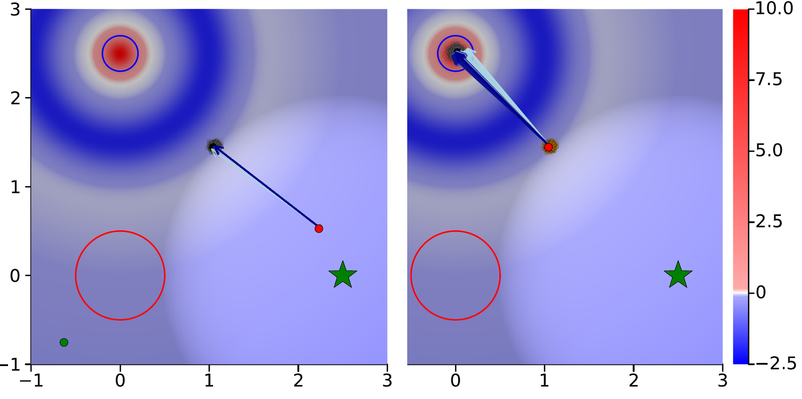

<p align="center">
  
</p>

# Action-Gradient Monte Carlo Tree Search

This repository contains the Julia implementation and experiment code for the IJCAI-ECAI 2026 paper **Action-Gradient Monte Carlo Tree Search for Non-Parametric Continuous (PO)MDPs**.

Authors: Idan Lev-Yehudi, Michael Novitsky, Moran Barenboim, Ron Benchetrit, and Vadim Indelman.

AGMCTS introduces action-gradient refinement inside Monte Carlo Tree Search for continuous MDPs and particle-belief POMDPs. Its Multiple Importance Sampling tree keeps action-value estimates consistent as gradient steps update actions, allowing local optimization to reuse prior simulated successor states.

## Algorithm Overview

AGMCTS keeps the standard MCTS simulation loop, while adding gradient-based action optimization and MIS updates that correct the tree values after an action branch moves.

<p align="center">
  
  
  
</p>

## Contents

- `src/ActionGradientMCTS.jl`: reusable Julia package entry point for AGMCTS.
- `src/core/`: solver, planner, tree, value update, action update, and propagated-belief MDP implementation units.
- `experiments/`: separate Julia project for paper domains, baselines, domain-specific AGMCTS integrations, and experiment runners.
- `experiments/src/baselines/VOOSampling.jl`: VOO/VPW action-sampling component used by the baselines.
- `experiments/src/domains/`: Probabilistic MountainCar, LunarLander, and Collaborative Light-Dark benchmark domains.
- `experiments/src/integrations/`: domain-specific `grad_reward`, `grad_log_transition`, `transition_log_likelihood`, and `project_action` methods for AGMCTS.
- `experiments/run_experiment.jl`: unified CLI for simulations, CE optimization, and ablations.
- `analysis/`: scripts for summarizing tables and plotting ablation trends from CSV results.
- `test/`: package-boundary smoke tests for the public code bundle.

Large generated result directories are intentionally excluded from this repository. See `data/README.md` for the expected layout if you want to rerun the analysis scripts on CSV outputs.

## Citation

We kindly ask that you cite our paper if you find this code useful.

- Full version: https://arxiv.org/abs/2503.12181
- Conference/accepted version: to appear in the IJCAI-ECAI 2026 proceedings.

Lev-Yehudi, I., Novitsky, M., Barenboim, M., Benchetrit, R., & Indelman, V. (2026). Action-Gradient Monte Carlo Tree Search for Non-Parametric Continuous (PO)MDPs. arXiv:2503.12181. Accepted to IJCAI-ECAI 2026.

```bibtex
@misc{LevYehudi26agmcts,
  title={Action-Gradient Monte Carlo Tree Search for Non-Parametric Continuous (PO)MDPs},
  author={Lev-Yehudi, Idan and Novitsky, Michael and Barenboim, Moran and Benchetrit, Ron and Indelman, Vadim},
  year={2026},
  eprint={2503.12181},
  archivePrefix={arXiv},
  primaryClass={cs.AI},
  doi={10.48550/arXiv.2503.12181},
  note={Full version. Accepted to IJCAI-ECAI 2026}
}
```

## Core Package Setup

Install Julia 1.10 or newer, then run from the repository root:

```bash
julia --project=. -e 'using Pkg; Pkg.instantiate()'
```

Use the package from Julia with:

```julia
using ActionGradientMCTS
```

## Core Smoke Test

```bash
julia --project=. test/runtests.jl
```

The smoke test checks that AGMCTS exports the reusable solver/planner API and that experiment-only packages are not dependencies of the root package.

## Experiment Setup

The paper domains and utilities live in their own environment so the solver package can be reused without plotting, benchmarking, and domain dependencies.

```bash
julia --project=experiments -e 'using Pkg; Pkg.instantiate()'
```

The experiments environment records `ActionGradientMCTS` as a local path dependency on `..`.

## Running Experiments

Use `experiments/run_experiment.jl` from the repository root. Use `--test-mode` for reduced settings before launching a full experiment.

```bash
julia --project=experiments experiments/run_experiment.jl --domain mountain-car --mode sim --solver ag-dpw --test-mode
julia --project=experiments experiments/run_experiment.jl --domain lunar-lander --mode sim --solver dpw ag-dpw vomcpow --test-mode
julia --project=experiments experiments/run_experiment.jl --domain collab-light-dark --mode sim --solver all --test-mode
```

Common flags:

- `--domain mountain-car|lunar-lander|collab-light-dark`: choose the benchmark domain.
- `--mode sim|ce-opt|ablation`: choose the experiment mode.
- `--solver dpw|ag-dpw|vpw|ag-vpw|pomcpow|vomcpow|all`: choose one or more solvers.
- `--mdp`, `--simple`, `--D`, `--K`: domain options.
- `--test-mode`: use reduced experiment sizes.

Each solver keyword runs one algorithm. On POMDP domains, `dpw`, `ag-dpw`, `vpw`, and `ag-vpw` run their particle-filter-tree variants:

| Solver keyword | POMDP algorithm | MDP algorithm |
| --- | --- | --- |
| `dpw` | PFT-DPW | DPW |
| `ag-dpw` | AG-PFT-DPW | AG-DPW |
| `vpw` | PFT-VPW | VPW |
| `ag-vpw` | AG-PFT-VPW | AG-VPW |
| `pomcpow` | POMCPOW | not supported |
| `vomcpow` | VOMCPOW | not supported |
| `all` | all six POMDP algorithms | DPW, AG-DPW, VPW, AG-VPW |

## Analysis Scripts

The analysis scripts expect scenario CSV folders under `data/ablations` by default and accept `--base-path` for another local result directory.

```bash
python3 analysis/process_tables.py --base-path data/ablations
python3 analysis/ablation_trend_plots.py --base-path data/ablations --output analysis/mdp_pomdp_grid_results.pdf
```
